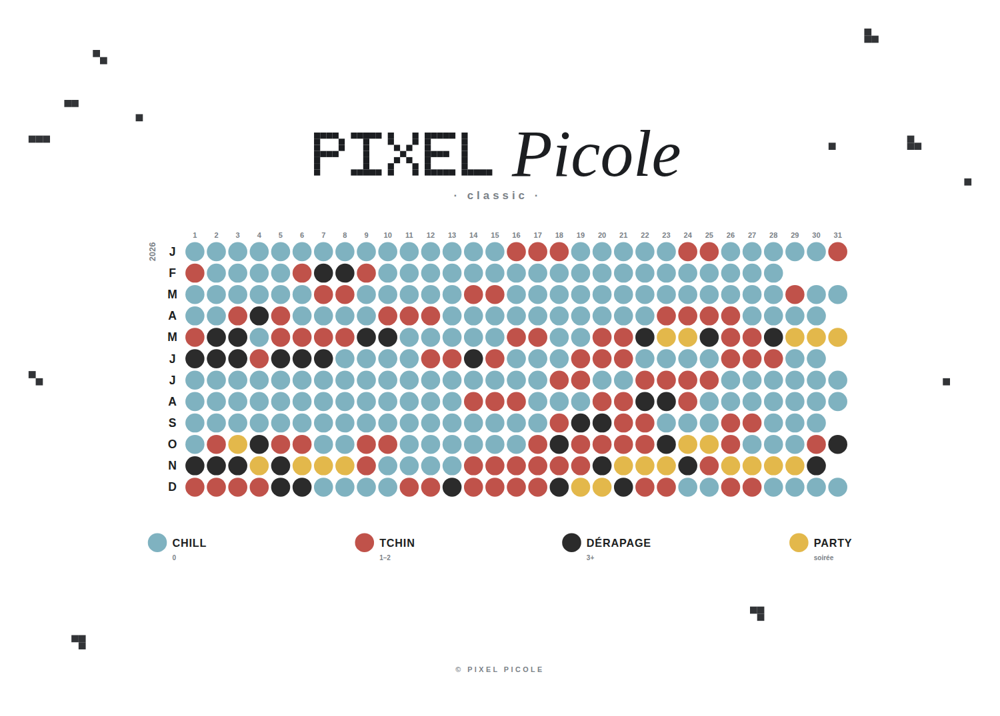
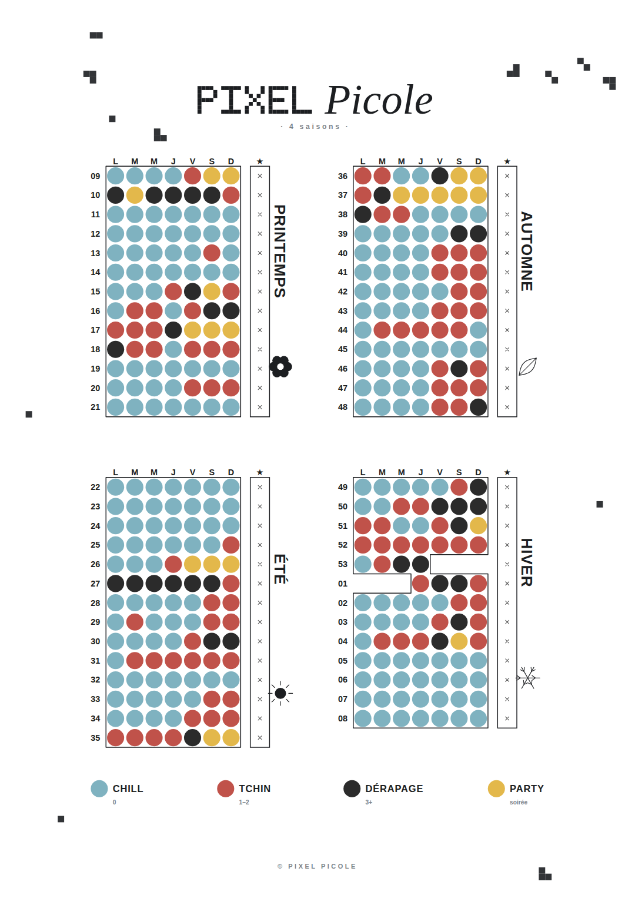
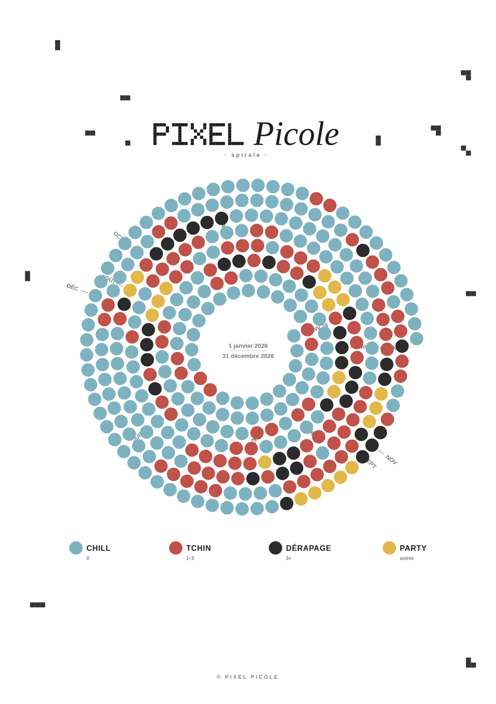
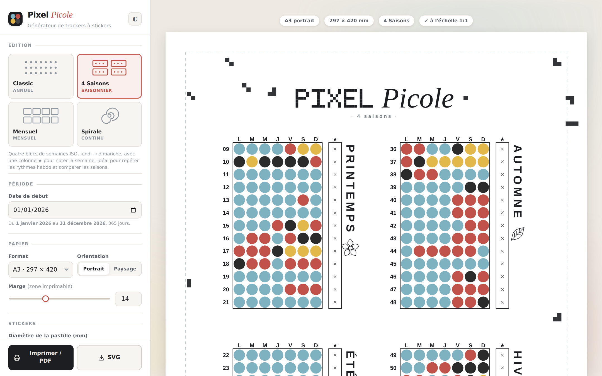

<div align="center">


# PIXEL *Picole*

**One year, one cell per day, one sticker.**

Printable tracker sheets. A single HTML file with no dependencies.






*Sheets print empty. Shown here with the filled preview.*

</div>

---

## The idea

A wall tracker is a logbook, not a goal.

Stick one sticker a day and write nothing down. After a couple of months the wall
starts talking. Fridays stand out. Heavy weeks at work stand out. That trip in
March stands out.

Goals come from there, from a pattern you watched appear and now want to move.

- A cell records what happened. Nothing more.
- Name it the way you would to a friend. CHILL, TCHIN, PARTY. Every label is
  yours to change.
- Ten seconds a day. A ritual that asks for more stops within weeks.

A grid of days has nothing to do with alcohol. Track what you want to see shrink,
or what you want to see grow.

## Using it



Open `index.html` in a browser. Pick an edition, a start date, a paper size and a
sticker shape. The filled preview draws a plausible year so you can judge the
colours before buying anything. Print at full size, or export SVG.

The title takes any of several fonts, and the first word can be set in pixel
squares. Any setting that differs from its default shows a small arrow next to
it, which puts that one setting back. A strip at the top of the panel counts
what has moved and puts everything back at once.

Settings stay in your browser. The interface is in French, and every label on the
sheet is editable.

### Editions

| | |
| --- | --- |
| **Classique** | The whole year in one grid. Streaks jump out. |
| **4 Saisons** | Weeks grouped by season, with a column to rate each week. |
| **Mensuel** | Twelve small calendars on real weekdays. Shows the weekend effect. |
| **Spirale** | The year as one continuous ribbon. |

### Stickers

Cells are capped at the size of a stationery sticker. Smaller is free, larger is
not. One switch raises the cap for other sticker sizes.

The paper follows the grid, so some editions will not fit on smaller sheets. The
generator says so and offers a size that works.

Round, square and triangle stickers. The printed guide can be a dot, an outline,
a filled shape, a cross or the day number, in any shade of grey.

A sticker cut in half can be laid over a whole one. Two halves cut at different
angles leave three colours visible in one cell. The option sits under the sticker
list and is off by default.

### Themes

Pixel Picole is the default. A selector fills in the title and stickers for other
subjects: screens, series, exercise, sleep, cooking, intimacy, mood. Rename,
recolour, add or remove stickers from there.

## Publishing

Enable Pages with GitHub Actions as the source, then push. The workflow is in the
repo. Any static host works, and so does sending someone the file.

## Adding an edition

An edition is an object passed to `registerDesign()`. It draws into an abstract
canvas in millimetres, from any origin. The engine crops, adds the title, legend
and footer, scatters the decoration, centres it and checks that it fits.

```js
registerDesign({
  id: "trimestres",
  name: "Trimestres",
  cadence: "Trimestriel",
  desc: "Une phrase sur ce que cette édition montre le mieux.",
  prefer: "landscape",
  icon: '<g fill="currentColor">…</g>',
  options: [
    { id: "grid", label: "Encadrer les blocs", type: "switch", def: true }
  ],

  // Optional. Only when the edition frames its own span.
  period(start, o) { return { start, end: addDays(plusOneYear(start), -1) }; },

  build(c, x) {
    x.days.forEach((dt, i) => c.dot(col(i), row(i), { day: i }));
  }
});
```

The context hands you the period, the cell pitch, the sticker radius, a base font
size and your option values. Primitives are `dot`, `txt`, `line`, `rect`, `poly`
and `disc`. Colours are logical names. Tagging a cell with its day index enables
the filled preview.

New editions appear in the picker on their own. The four existing ones are the
reference.

## Contributing

- No dependencies and no build step.
- The engine works in millimetres. A sheet prints at true scale or it does not
  print.
- Test across start dates. Leap years and mid-month starts are where it breaks.
  Every day of the period must land in exactly one cell.
- Keep the wording kind. No shaming language in labels, themes or the interface.

Code and comments are in French.

## Licence

Apache 2.0. See [LICENSE](LICENSE) and [NOTICE](NOTICE).

---

<div align="center">

© 2026 Pixel Picole

</div>
